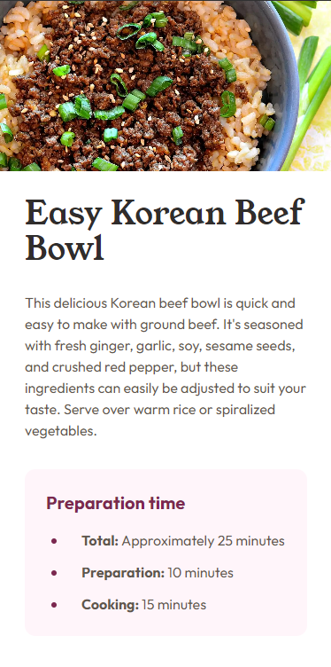

# Recipe Page

A Recipe Page of my favorite foods.

## Table of contents

- [Overview](#overview)
  - [The challenge](#the-challenge)
  - [Screenshot](#screenshot)
  - [Links](#links)
- [My process](#my-process)
  - [Built with](#built-with)
  - [What I learned](#what-i-learned)
  - [Continued development](#continued-development)
  - [Useful resources](#useful-resources)
- [Author](#author)
- [Acknowledgments](#acknowledgments)

## Overview

### Screenshot



### Links

- Live Site URL: [Add live site URL here](https://your-live-site-url.com)

## My process

### Built with

- Semantic HTML5 markup
- Tailwind CSS

### What I learned

This challenge will help me focus on Tailwind CSS.
How to use @apply to use a base style to project.
How to write custom configuration

```javascript
/** @type {import('tailwindcss').Config} */
module.exports = {
  content: ["./src/**/*.{html,js}"],
  theme: {
    extend: {
      colors: {
        primary: "hsl(14, 45%, 36%)",
        secondary: "hsl(332, 51%, 32%)",
        roseWhite: "hsl(330, 100%, 98%)",
        eggShell: "hsl(30, 54%, 90%)",
        lightGrey: "hsl(30, 18%, 87%)",
        wengeBrown: "hsl(30, 10%, 34%)",
        darkCharcoal: "hsl(24, 5%, 18%)",
      },
      fontFamily: {
        young: ["Young Serif", "serif"],
        outfit: ["Outfit", "sans-serif"],
      },
    },
  },
  plugins: [],
};
```

```css{
@layer base {
    body {
        @apply text-base;
    }

    h1 {
        @apply font-young;
        @apply text-darkCharcoal;
        @apply text-4xl;
    }
    h2 {
        @apply font-young;
        @apply text-primary;
        @apply text-3xl;
    }

    p {
        @apply font-outfit;
        @apply text-wengeBrown;
        @apply font-normal;
    }

    span {
        @apply font-bold;
    }

    td {
        @apply py-3;
        @apply pl-7
    }
    tr {
        @apply border-b
    }
```

}

### Continued development

### Useful resources

- [resource 1](https://www.allrecipes.com/) - This helped me find the recipes.
- [resource 2](https://tailwindcss.com/) - Docs of tailwind

## Author

- Website - [Valdeir Rodrigues](https://www.your-site.com)
- Twitter - [@VardiRdg](https://twitter.com/VardiRdg)
